# Отчёт по лабораторной работе №1: Football League Management API

## Описание проекта

Это Spring Boot-приложение предназначено для управления футбольной лигой. Оно реализует REST API с поддержкой CRUD-операций над сущностями: `Team`, `Player`, `Coach`, `League` и `Match`.

### Технологии

1. `Spring Boot`: Для быстрого создания приложения и удобного взаимодействия с компонентами Java.
2. `Spring Data JPA`: Для реализации ORM и взаимодействия с базой данных.
3. `PostgreSQL`: Реляционная база данных для хранения данных.
4. `MapStruct`: Для преобразования сущностей в DTO и обратно.
5. `DTO`: Для изоляции внутренней структуры базы данных от внешнего API.

## Особенности JPA

JPA (Java Persistence API) — это спецификация для работы с объектно-реляционным отображением (ORM) в Java. JPA позволяет Java-программам взаимодействовать с базой данных, не прописывая SQL-запросы вручную. Вместо этого используется объектно-ориентированная модель данных, где объекты Java автоматически отображаются в строки таблиц базы данных.

**Основные особенности JPA:**

1. Автоматическое отображение объектов Java в таблицы базы данных:
    JPA автоматически связывает объекты с таблицами и столбцами.

2. Поддержка транзакций:
    JPA управляет транзакциями с помощью аннотаций, таких как `@Transactional`, и автоматической работы с сессиями.

3. Аннотации для описания связей:
    `@OneToMany`, `@ManyToOne`, `@OneToOne`, `@ManyToMany` позволяют описать связи между сущностями.

4. Хранение встраиваемых объектов:
    Встроенные объекты, такие как статистика игрока, можно отображать с помощью аннотации `@Embedded`.

5. Поддержка репозиториев:
    Spring Data JPA предоставляет удобные методы для работы с базой данных через интерфейсы репозиториев.

## Структура проекта

**В проекте используется следующая структура пакетов:**

1. `entity`: Содержит классы сущностей для базы данных, например `Team`, `Player`, `Coach`, `League`, `Match`.

2. `dto`: Содержит DTO классы для передачи данных через API.

3. `mapper`: Содержит классы для маппинга между сущностями и DTO с использованием `MapStruct`.

4. `repository`: Репозитории для работы с базой данных.

5. `service`: Логика приложения, предоставляющая CRUD-операции.

6. `controller`: REST контроллеры для обработки запросов API.

**`application.properties`:  Файл конфигурации для подключения к базе данных и настройки приложений Spring Boot.**

## Основные сущности и связи

### League

- Имеет несколько команд (One-to-Many)
- Включает в себя несколько матчей (One-to-Many)

### Team

- Принадлежит одной лиге (Many-to-One)
- Имеет одного тренера (One-to-One)
- Включает нескольких игроков (One-to-Many)
- Участвует в нескольких матчах (Many-to-Many)

### Player

- Принадлежит одной команде (Many-to-One)
- Содержит встроенный объект `PlayerStats` со статистикой

### Coach

- Один тренер работает только с одной командой (One-to-One)

### Match

- Участвуют две команды: домашняя и гостевая (две связи Many-to-One)
- Принадлежит одной лиге (Many-to-One)

## Реализованный функционал

1. Полная поддержка CRUD-операций для cущностей `Team`, `Player`, `League`, `Match`
2. Эндпоинты:
    - `/api/players`
    - `/api/teams`
    - `/api/leagues`
    - `/api/matches`
3. DTO-слой изолирует внутреннюю структуру базы данных от внешнего API
4. Использование встроенного объекта `@Embedded` для хранения статистики игрока
5. Корректное отображение связанных сущностей через их ID в DTO

## Пример реализации некоторых особенностей JPA

1. **Match Mapper**
    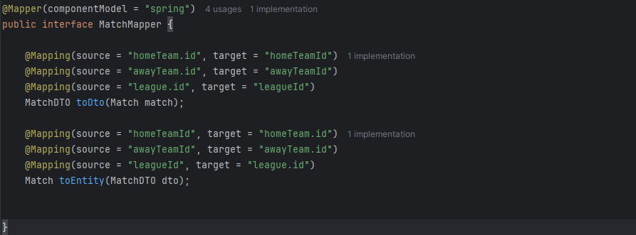

2. **Team Controller**
    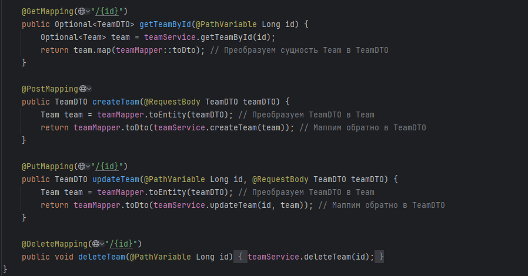

3. **Player Service**
    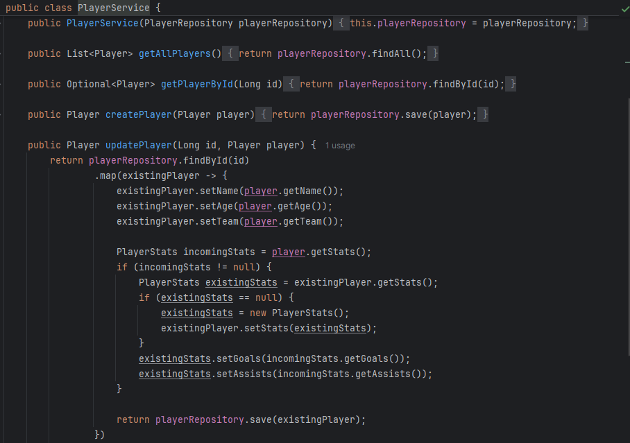

## Пример работы ендпоинтов

### Ендпоинты связанные с командой

1. `POST`   : `/api/teams` - создание новой команды
    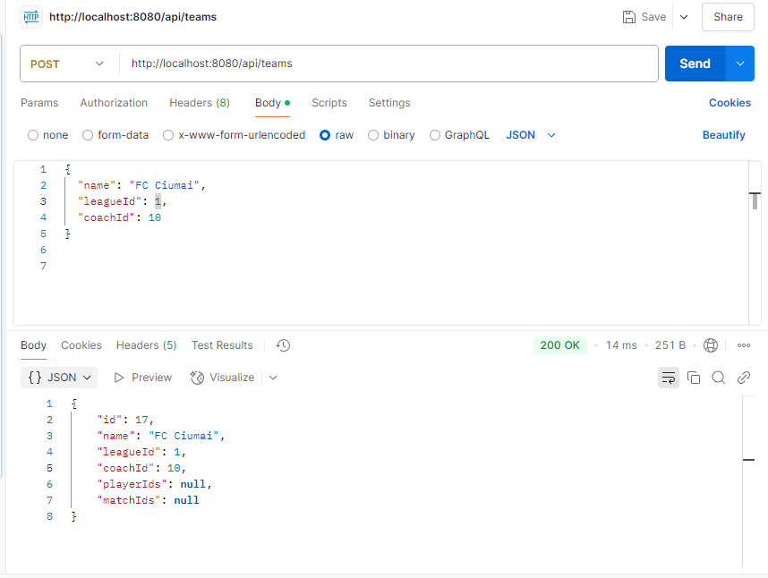

2. `GET`    : `/api/teams` - получение списка команд
    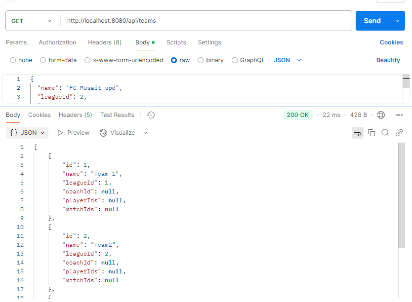

3. `PUT`    : `/api/teams/{id}` - рекдактирование данных команды
    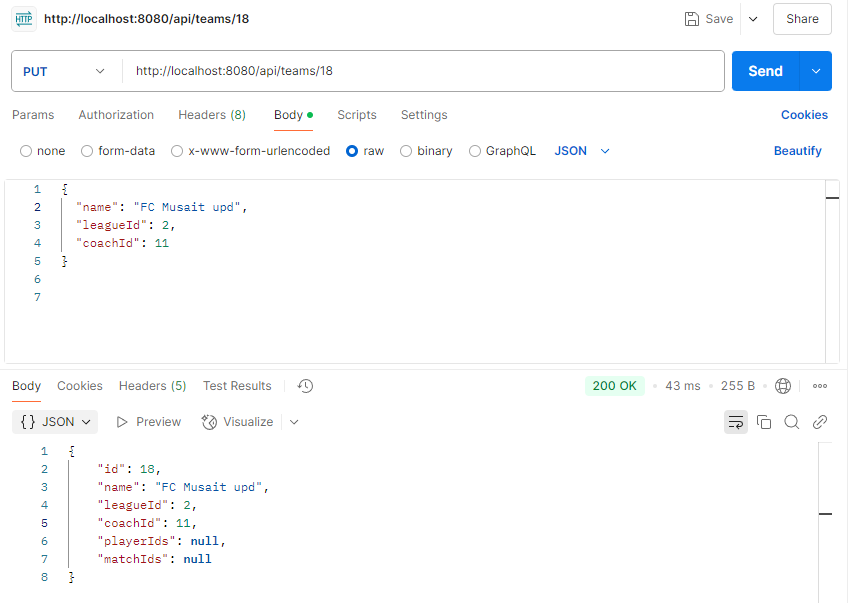

4. `DELETE` : `/api/teams/{id}` - удаление команды
    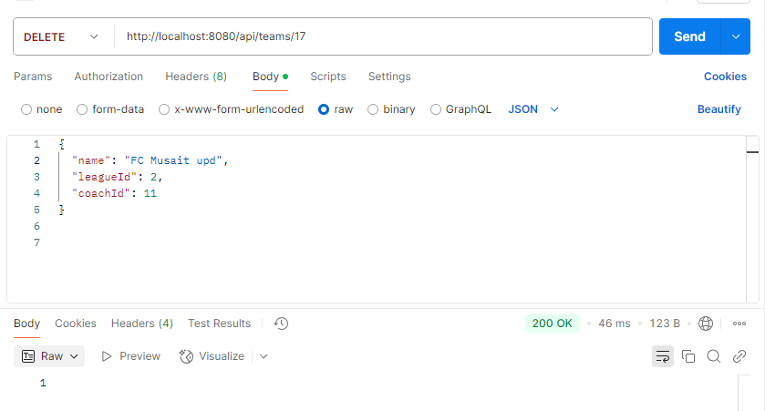

### Ендпоинты связанные с игроками

1. `POST`   : `/api/players` - создание новой команды
    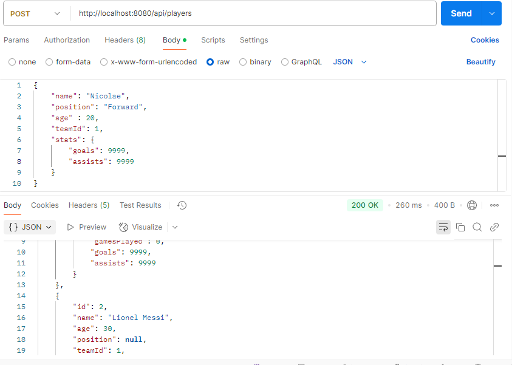

2. `GET`    : `/api/players` - получение списка команд
    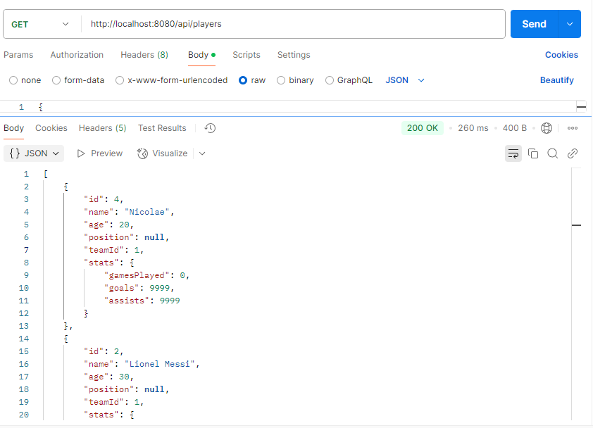

3. `PUT`    : `/api/players/{id}` - рекдактирование данных команды
    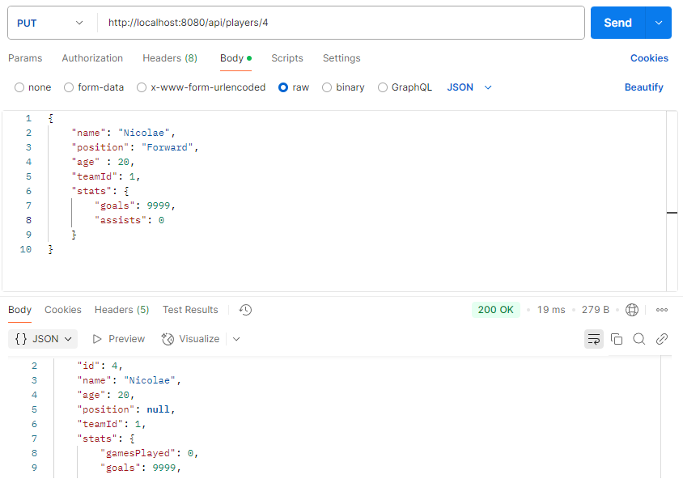

4. `DELETE` : `/api/players/{id}` - удаление команды
    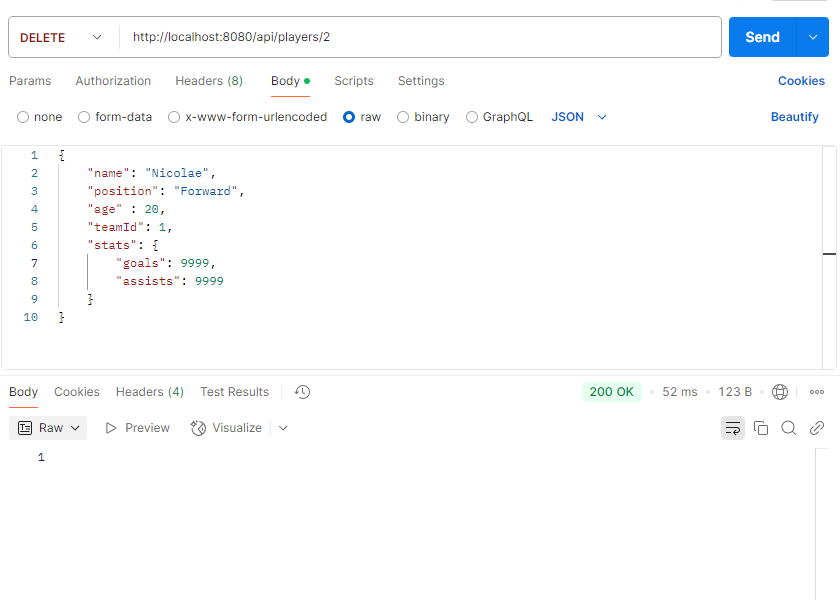

## Вывод

В ходе работы был разработан Spring Boot проект с использованием JPA для взаимодействия с базой данных. Все операции выполняются через REST API с использованием DTO для изоляции данных. Взаимосвязанные сущности обеспечивают полную функциональность CRUD-операций. Приложение поддерживает работу с сущностями, такими как `Team`, `Player`, `Coach`, `League` и `Match`.

Использование JPA позволило упростить работу с базой данных, автоматизировав процессы отображения объектов в таблицы и взаимодействие с ними.

## Библиография

1. `https://javarush.com/groups/posts/2259-jpa--znakomstvo-s-tekhnologiey`
2. `https://chatgpt.com/`
3. `https://moodle.usm.md/mod/assign/view.php?id=301783`
