# Отчёт по лабораторной работе №2: Football League Management API

## Цель работы

Целью работы было разработать Spring Boot приложение для управления библиотекой спортивных данных с использованием Hibernate для работы с базой данных. Основная задача заключалась в том, чтобы реализовать CRUD-операции через REST API и использовать Hibernate для работы с базой данных. В отличие от второй лабораторной работы, где использовался JDBC, в этой лабораторной было важно использовать ORM-подход с помощью Hibernate.

## Основные/ключевые моменты

Для выполнения работы был реализован Spring Boot проект с использованием Hibernate для взаимодействия с базой данных. Были созданы три контроллера и три сервиса, работающие с пятью взаимосвязанными сущностями. Приложение поддерживает операции CRUD через REST API и использует DTO для передачи данных, исключая прямую работу с сущностями базы данных.

Также были удалены лишние JPA - зависимости и добавлена зависимость для работы с Hibernate:

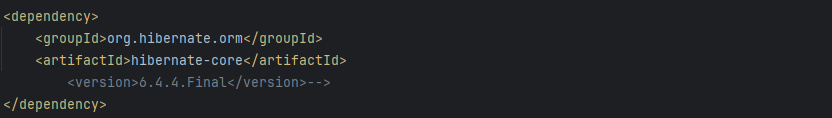

Пример файловой структуры проекта:

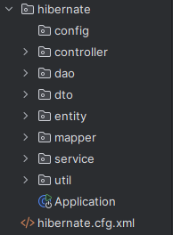

## Основные изменения

1. Вместо JPA как абстракции был напрямую использован Hibernate как реализация ORM.
2. Репозитории были заменены на вручную реализованные DAO.
3. `application.properties` был заменен на `hibernate.cfg.xml`
4. Вручную реализован контроль сессий

### Отличие Hibernate от JPA

В первой лабораторной работе использовался JPA (Java Persistence API) — это спецификация, которая определяет стандарт для ORM в Java, а Hibernate выступал лишь одной из возможных реализаций этой спецификации.

Во второй лабораторной работе Hibernate был использован напрямую, без абстракции JPA. Это позволило получить более гибкий контроль над ORM-механизмами, специфичными именно для Hibernate.

**Ключевые отличия:**

1. Стандартизация против реализации:
    - JPA — это интерфейс, который реализует Hibernate и другие ORM-инструменты (например, EclipseLink).
    - Hibernate — это конкретная реализация, включающая дополнительные, нестандартизированные функции.

2. Возможности:
    - JPA предоставляет ограниченный, но унифицированный набор возможностей, обеспечивая переносимость.
    - Hibernate включает расширения JPA, такие как `@Fetch`, `@Cascade`, `@Where`, давая более тонкий контроль.

3. Гибкость и зависимость:
    - Использование JPA делает проект менее зависимым от конкретного ORM-провайдера.
    - Прямое использование Hibernate делает код менее переносимым, но даёт больше возможностей и контроля.

## Взаимосвязь сущностей

В рамках лабораторной работы была создана библиотека спортивных данных с пятью сущностями, которые связаны следующим образом:

1. `Team`: Команда может иметь только одного тренера (One-to-One), состоит из нескольких игроков (One-to-Many), может участвовать в нескольких матчах (Many-to-Many) и принадлежит одной лиге (Many-to-One).
2. `Player`: Каждый игрок принадлежит одной команде (Many-to-One). Статистика игрока хранится как встраиваемый объект.
3. `Coach`: Один тренер работает только с одной командой (One-to-One).
4. `League`: Лига включает несколько команд (One-to-Many) и матчей (One-to-Many).
5. `Match`: В матче участвуют две команды (homeTeam и awayTeam, Many-to-One для каждой).

## Реализация

Все запросы, например, такие как `POST` и `GET`, теперь работают с `DTO`, которые включают все связанные сущности. Например, при получении данных о команде в ответе будет информация о тренере, игроках, лигах и матчах.

Пример DAO для создания игрока в Hibernate:

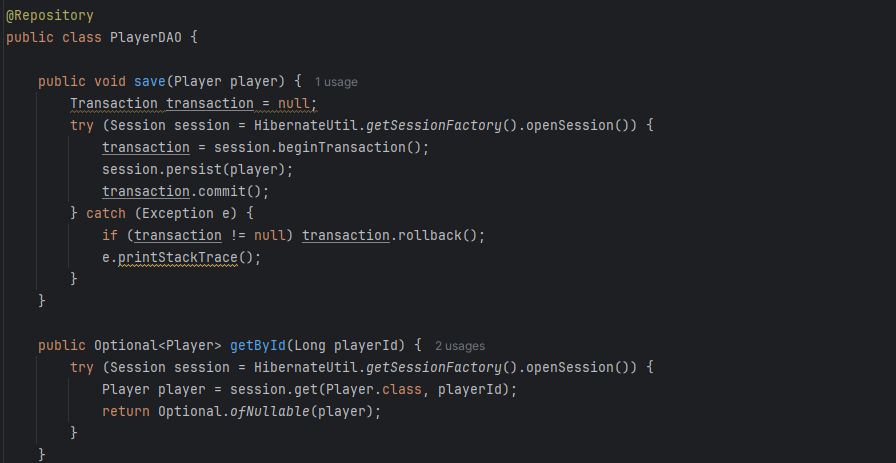

Реализация SessionFactory:

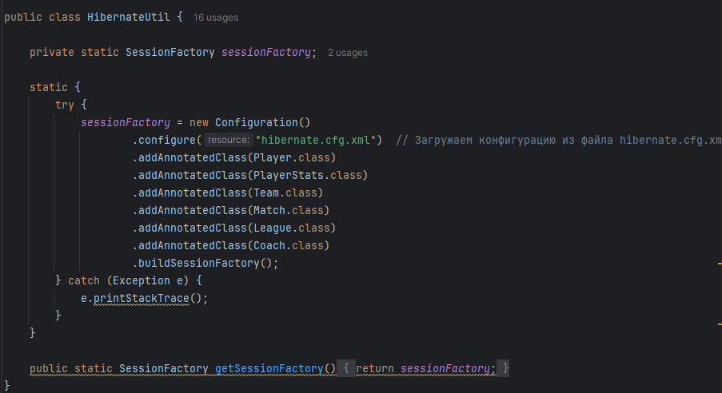

## Примеры эндпоинтов

### Ендпоинты для работы с командой

1. `POST /teams` — создание команды

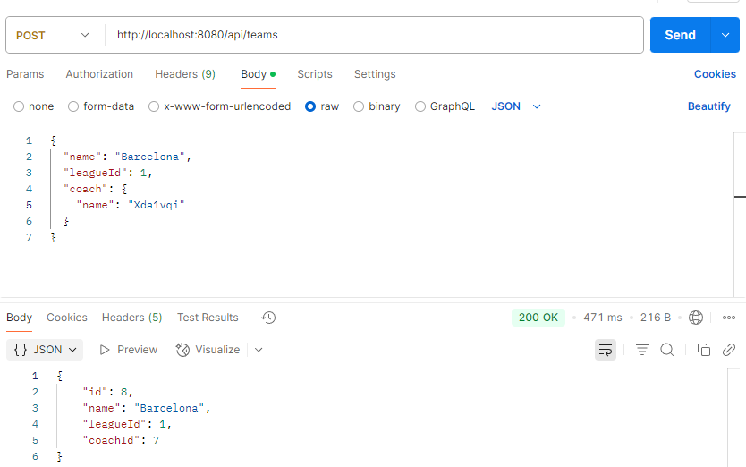
2. `GET /teams`  — получение информации командах

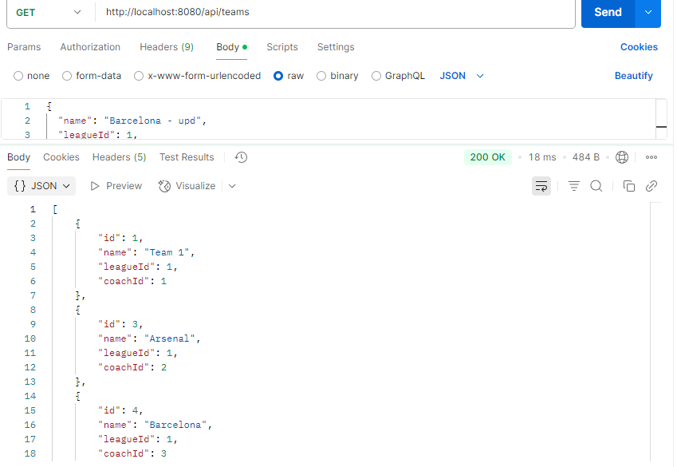
3. `PUT /teams/{id}`— обновление информации о команде

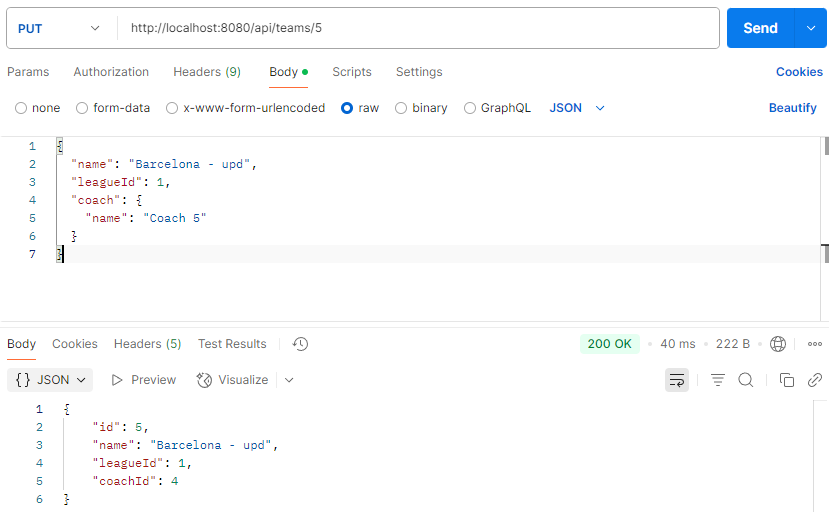
4. `DELETE /teams/{id}` — удаление команды

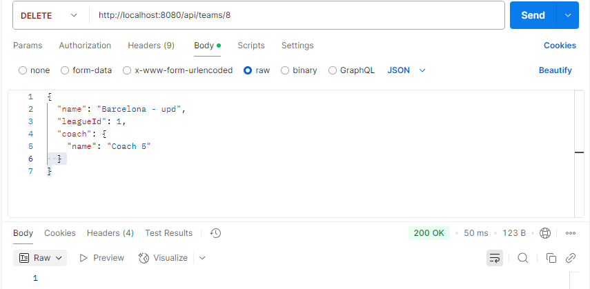

### Ендпоинты для работы с игроками

Ендпоинты для работы с игроками

1. `POST`   : `/players` — создание игрока

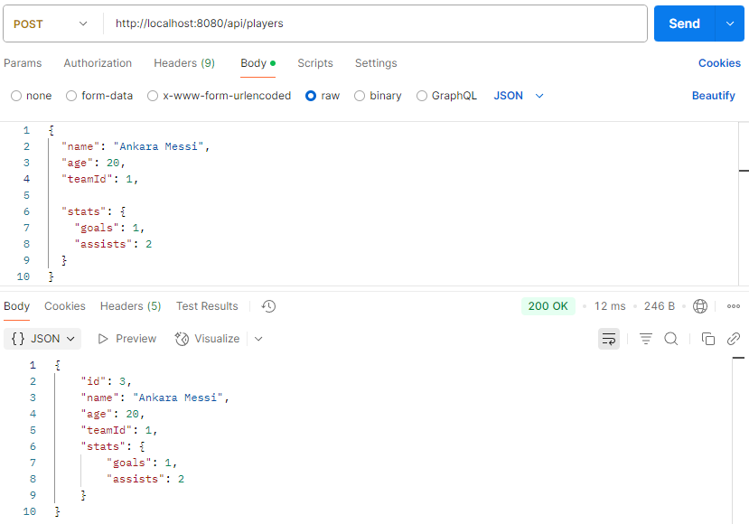
2. `GET`    : `/players/{id}` — получение информации о игроке по его ID

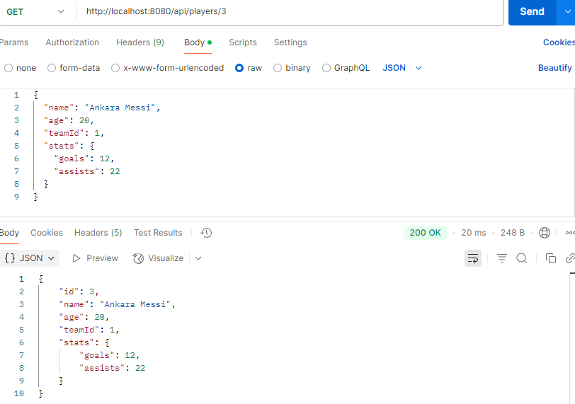
3. `PUT`    : `/players/{id}` — обновление информации о игроке

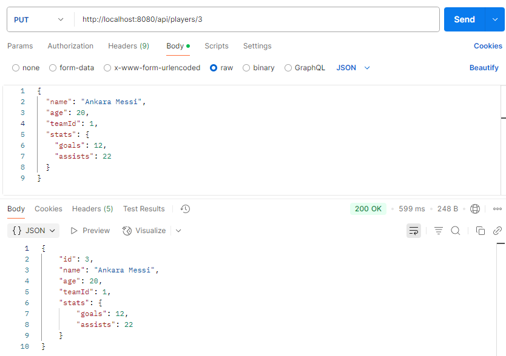
4. `DELETE` : `/players/{id}` — удаление игрока

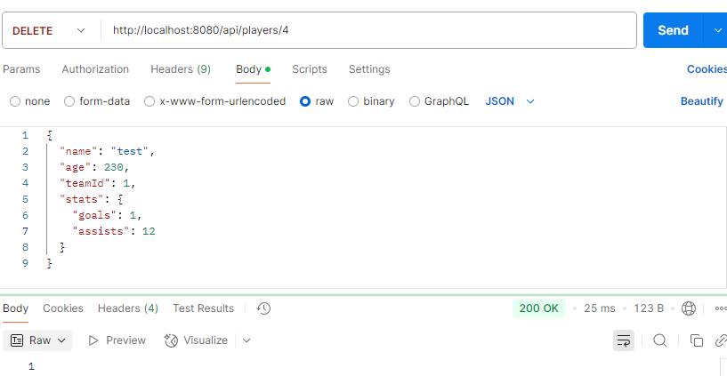

### Вывод

В результате работы была разработана система с использованием Hibernate для работы с базой данных, которая поддерживает CRUD-операции через REST API. Все запросы выполняются с использованием DTO для передачи данных. Особое внимание было уделено связям между сущностями и правильной валидации данных. Hibernate упростил работу с базой данных, предоставив высокоуровневые инструменты для работы с объектами и их связями.

### Библиография

1. `https://stackoverflow.com/questions/33720355/maven-how-to-add-all-required-dependencies-for-hibernate`

2. `https://chatgpt.com/`

3. `https://spring.io/projects/spring-boot`
