# Отчет по лабораторной работе №3: Football League Management API

## Цель работы

Целью работы было разработать Spring Boot приложение для управления библиотекой спортивных данных с использованием JDBC. Основной задачей было заменить JPA и Hibernate на Spring JDBC.

## Основные/ключевые моменты

Для выполнения работы была взята за основу первая лабораторная работа, в которой использовались JPA и Hibernate. В данной лабораторной работе было исключено все лишнее, такие как избыточные зависимости в pom.xml, несколько излишних полей в объектах, а также изменены некоторые сервисы для работы с JDBC. Приложение теперь использует JDBC для работы с базой данных.

Пример файловой структуры проекта:

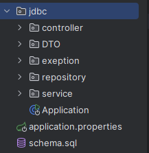

## Основные изменения

1. Удалены зависимости JPA и Hibernate.
2. Изменены репозитории для работы с JDBC — вместо использования репозиториев JPA, были написаны репозитории с использованием `JdbcTemplate`.
3. Реализована валидация данных — в запросах проверяется существование связанных сущностей по ID.
4. DTO вместо Entity — как и в первой лабораторной, для работы с данными используется только DTO (Data Transfer Objects), что исключает прямую работу с сущностями базы данных в API.

## Отличие JDBC от JPA и Hibernate

Основное отличие между JDBC и JPA (или Hibernate) заключается в том, что в JDBC работа с базой данных осуществляется напрямую через SQL-запросы, что дает полный контроль над выполнением запросов, но требует большего количества кода для реализации CRUD-операций. В отличие от этого, JPA и Hibernate обеспечивают абстракцию уровня данных, автоматически генерируя SQL-запросы, что упрощает работу с базой данных, но иногда может быть менее гибким.

**Ключевые отличия:**

1. Работа с базой данных:
    - JDBC требует явного написания SQL-запросов для каждой операции.
    - JPA/Hibernate генерирует SQL-запросы на основе описания сущностей, что облегчает разработку, но ограничивает гибкость.

2. Управление транзакциями:
    - В JDBC разработчик вручную управляет транзакциями.
    - В JPA/Hibernate транзакции управляются автоматически через контекст персистентности.

3. Производительность:
    - JDBC может быть более производительным в случаях, когда требуется более детальный контроль над запросами.
    - JPA/Hibernate может иметь накладные расходы, связанные с дополнительными абстракциями.

### Примеры отличий в работе с JDBC

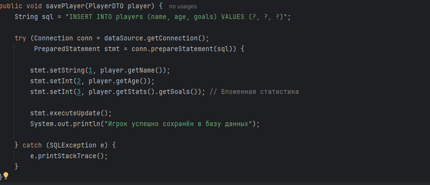

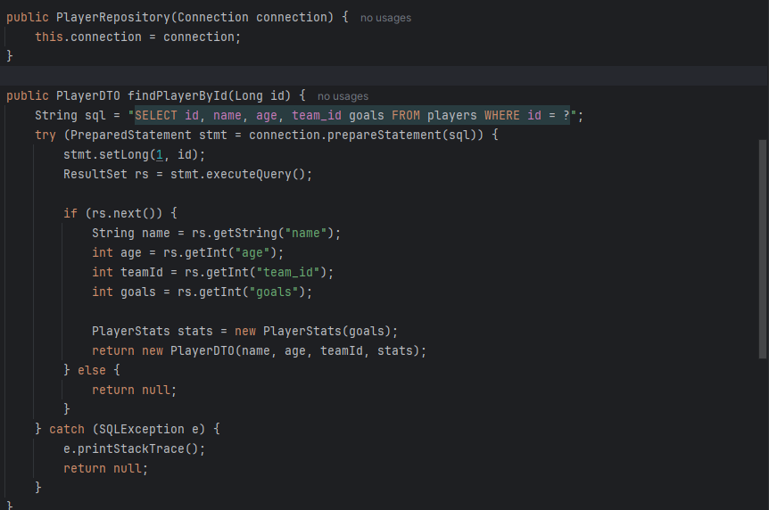

## Реализация

**Взаимосвязь сущностей**
Все запросы, такие как `POST` и `GET`, теперь работают с ID уже существующих сущностей. В случае создания команды, например, ID тренера, ID лиги и список ID игроков передаются в запросе. Это помогает избежать создания вложенных объектов и упрощает работу с данными.

**Валидация данных**
Валидация данных реализована следующим образом:

1. Строковые поля проверяются на пустоту.
2. Числовые поля проверяются на допустимость значений.
3. При создании или обновлении сущности проверяется существование всех связанных ID (например, нельзя привязать команду к несуществующему тренеру).

Пример базовой валидации:
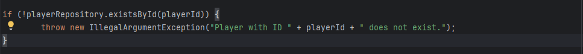

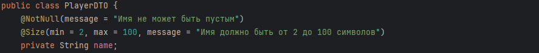

## Примеры эндпоинтов

### Ендпоинты для работы с командой

1. `POST /teams` — создание команды
    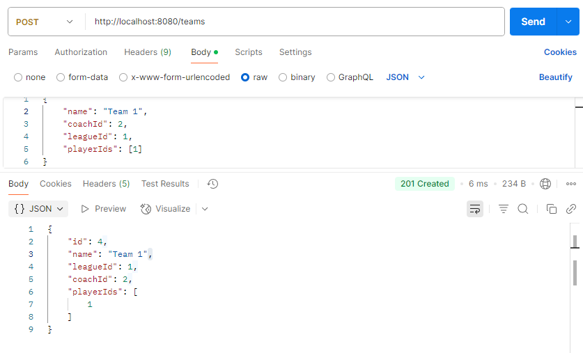

2. `GET /teams/{id}` — получение информации команды по ее ID
    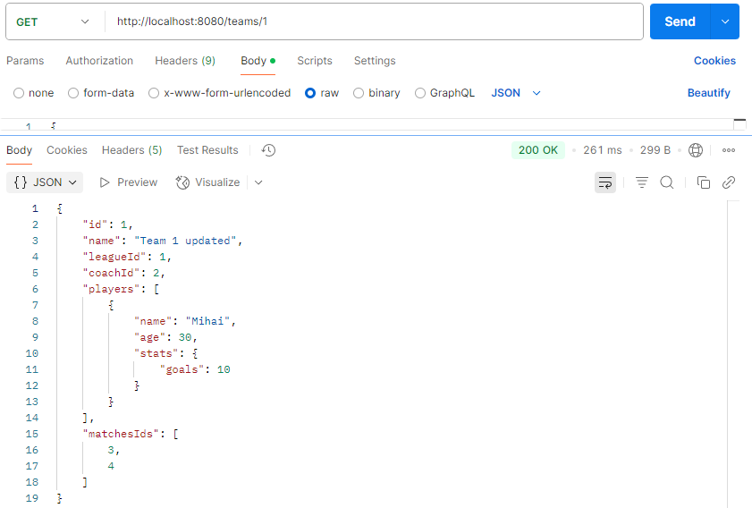

3. `PUT /teams/{id}` — обновление информации о команде
    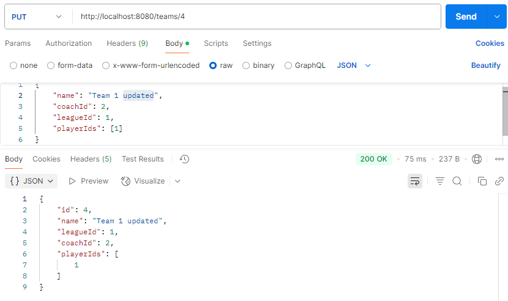

4. `DELETE /teams/{id}` — удаление команды
    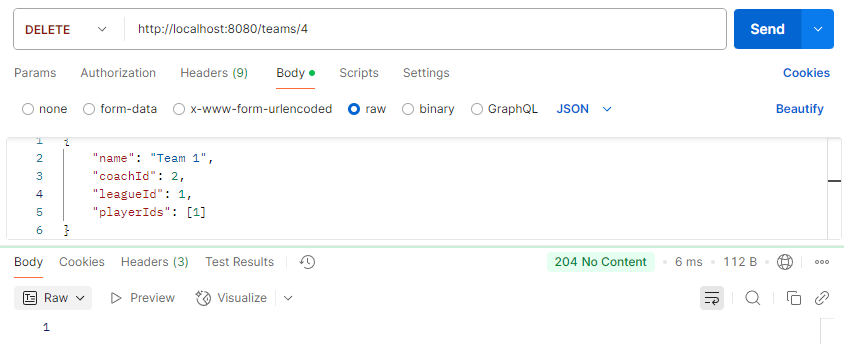

### Ендпоинты для работы с игроками

1. `POST /players` — создание игрока
    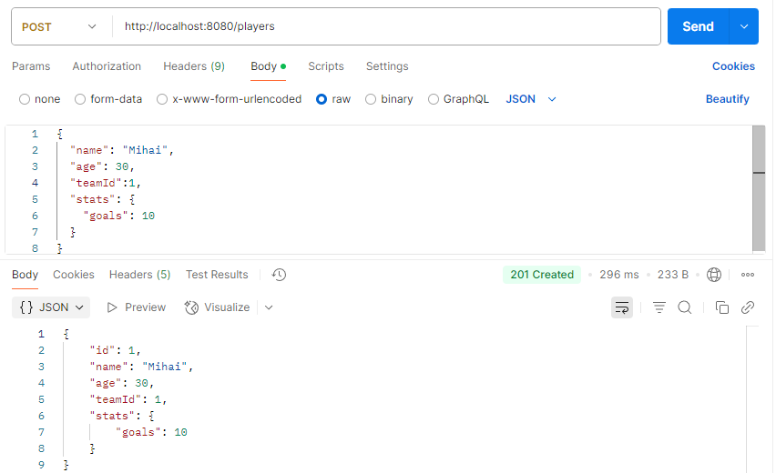

2. `GET /players/{id}` — получение информации о игроке по его ID
    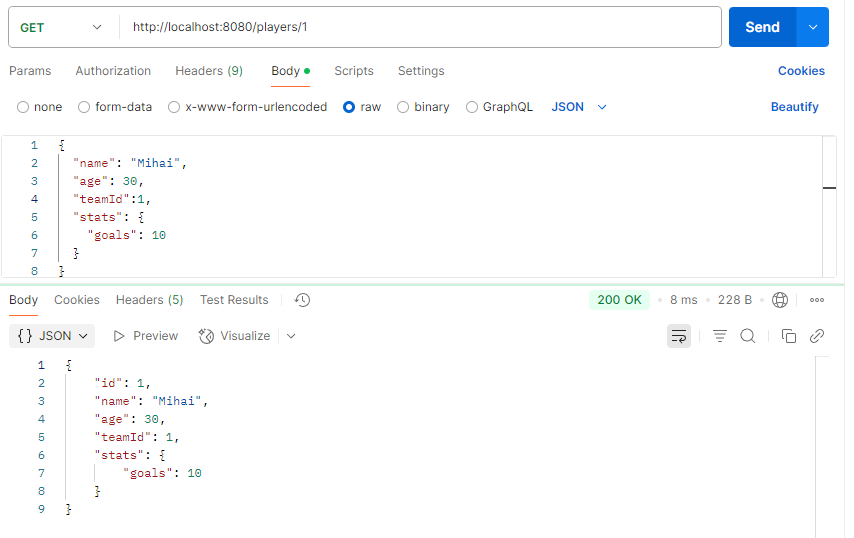

3. `PUT /players/{id}` — обновление информации о игроке
    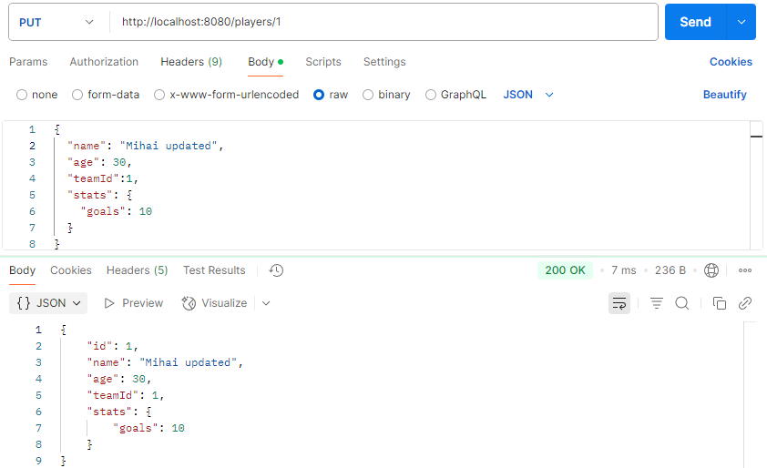

4. `DELETE /players/{id}` — удаление игрока
    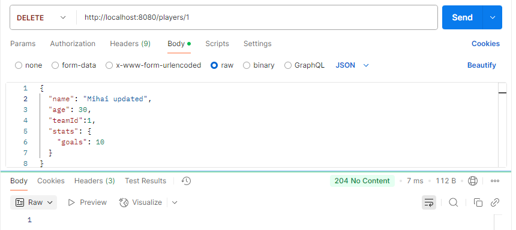

## Вывод

В результате работы был разработан проект с использованием Spring JDBC для работы с базой данных. В отличие от первой лабораторной работы, где использовались JPA и Hibernate, JDBC требует явной работы с SQL-запросами и предоставляет больший контроль над выполнением операций с базой данных. Все запросы теперь возвращают данные через DTO, при этом особое внимание уделено валидации данных и проверке существования связанных сущностей по ID.

## Библиография

1. `https://javarush.com/groups/posts/2172-jdbc-ili-s-chego-vsje-nachinaetsja`
2. `https://chatgpt.com`
3. `https://moodle.usm.md/mod/assign/view.php?id=305353`
